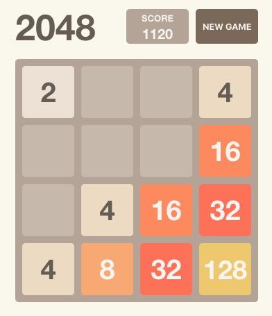

# 2048

This game is a React implementation of the [2048](<https://en.wikipedia.org/wiki/2048_(video_game)>) game.

Play the game [here](http://rbika.github.io/2048).



## Development environment

1. Clone the repository:

```
git clone
```

1. Change directory:

```
cd 2048
```

1. Run the application:

```
$ npm start
```

1. The application will be running on [localhost:3000]()
